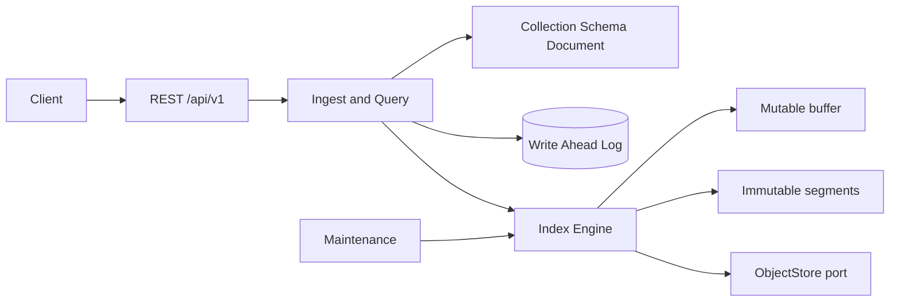

# Distributed Search Service

纯 Go 多租户全文检索与索引编排服务，面向知识库、产品文档和日志文本。服务使用 immutable segment、WAL 和可签名 search-after 游标，核心能力不依赖外部数据库即可本地运行；`internal/repository` 与 `internal/storage.ObjectStore` 是 PostgreSQL/对象存储接入边界。

## 快速启动

```bash
go test ./...
go vet ./...
make run
```

默认监听 `:8080`。每个请求必须带 `X-Tenant-ID`。主要接口：collection/schema、document upsert/delete/bulk、search/msearch/explain/count、analyzer/synonyms、segments、compact/tasks、health/consistency。错误统一为 `{code,message,request_id}`，写操作支持 `Idempotency-Key`，schema 更新需要 `If-Match`。



查询按租户和 collection 隔离，短语查询使用 token position，BM25 产生 explain 树；游标包含 generation、doc id 和 HMAC 签名，过期或索引 generation 不一致即拒绝。写入先追加并 fsync WAL，再更新内存段；重启时 `cmd/indexer` 可校验和回放 WAL。

未接入对象存储的 snapshot API 明确返回 `501 unimplemented`，不会伪造成功响应。gRPC 合约在 `api/proto/search.proto` 与 `internal/transport/grpc/contracts.go` 中保留，标准库构建下网络适配器返回明确 unimplemented。

默认 body 8 MiB、字段 128、bulk 1000、mutable buffer 100、并发查询 32。单节点建议 4 CPU/8 GiB；磁盘预留至少 2 倍 segment 大小用于 merge。SLO 目标：可用性 99.9%，查询 p99 < 300 ms（单分片、10 万文档），确认写入不丢失。

威胁模型包括租户头隔离、游标 HMAC、防 WAL 损坏、对象 key 路径穿越校验和敏感日志脱敏。生产部署应将 WAL、segment、snapshot 分离到持久卷，跨区域复制 manifest，定期演练 WAL 恢复、坏 segment quarantine 和 snapshot 回滚。当前本地 profile 不实现 RBAC、对象存储上传和真正多分片网络 fan-out，接口会返回明确错误或使用单进程 shard 引擎。
